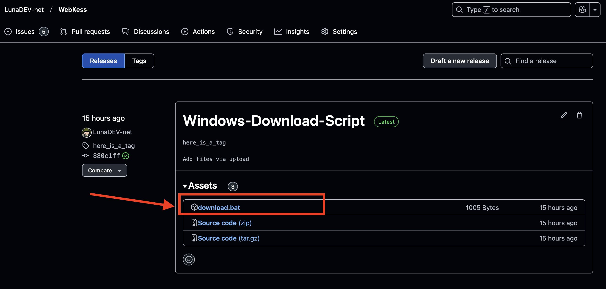

# WebKess: Bedienungsanleitung

## Übersicht
**WebKess** ist ein lokales Python-Programm, das Rohdaten von [Aktion Saubere Hände](https://www.aktion-sauberehaende.de/ueber-uns-ash) in ein Excel Format umwandelt, welches dann für Auswertungen oder Grafiken verwendet werden kann. Dieses Dokument bietet eine Anleitung zur Installation und Nutzung des Programms.

---

## Systemanforderungen
- **Windows 11**
- **Windows 10**, mit einer Betriebssystem-Buildnummer über `16299`  
  _Hinweis: Die Buildnummer kann unter `Einstellungen > System > Info` bei den `Windows-Spezifikationen` überprüft werden._

---

## Installation

### Installation über Download-Script
**Hinweis:** Dieses Verfahren funktioniert nur auf Windows.

1. Besuchen Sie die [Release-Website](https://github.com/LunaDEV-net/WebKess/releases).
2. Laden Sie die Datei `download.bat` herunter.  <br> 
3. Verschieben Sie die heruntergeladene Datei in den gewünschten Zielordner für das Programm:  
   Beispiel: Wenn sich die `download.bat` im Pfad `D:\Programme\download.bat` befindet, wird das Programm in den Ordner `D:\Programme\WebKess` installiert.
4. Doppelklicken Sie im Datei-Explorer auf die Datei `download.bat`, um sie auszuführen.
5. Das Script installiert die Software automatisch.

---

## Nutzung

1. **Rohdaten vorbereiten**
   Laden Sie die Rohdaten herunter. Die Datei muss im CSV-Format vorliegen und sollte folgendes Schema aufweisen (zur Sicherheit mit Excel öffnen und überprüfen):

   | KISS-Kürzel | IntervallId | Stationsname | Startdatum | Enddatum | BeobachtungsId | Beobachtungsdatum | Berufsgruppe | Indikation | Aktion | Handschuhe | Import KisRecordId Intervall | Import KisRecordId Beobachtung |
   |--------------|-------------|--------------|------------|----------|----------------|-------------------|--------------|------------|--------|------------|------------------------------|--------------------------------|

2. **Datei vorbereiten**
   Benennen Sie die Datei im File-Explorer in `input.csv` um und verschieben Sie diese in den Ordner `data`.
   
   Verzeichnisstruktur vor der Verarbeitung:
   ```
   WebKess
   ├─ data\
   │   └─ input.csv
   ├─ docs\
   │   └─ de-DE.md
   ├─ example_data\
   ├─ README.md
   └─ run.bat
   ```

3. **Programm ausführen**
   Führen Sie die Datei `run.bat` aus, indem Sie diese im Datei-Explorer per Doppelklick öffnen.

4. **Ergebnisse speichern**
   Nach der Verarbeitung wird die bearbeitete Datei als `output.csv` im Ordner `data` gespeichert.

   Verzeichnisstruktur nach der Verarbeitung:
   ```
   WebKess
   ├─ data\
   │   ├─ input.csv
   │   └─ output.csv
   ├─ docs\
   │   └─ de-DE.md
   ├─ example_data\
   ├─ README.md
   └─ run.bat
   ```

---

